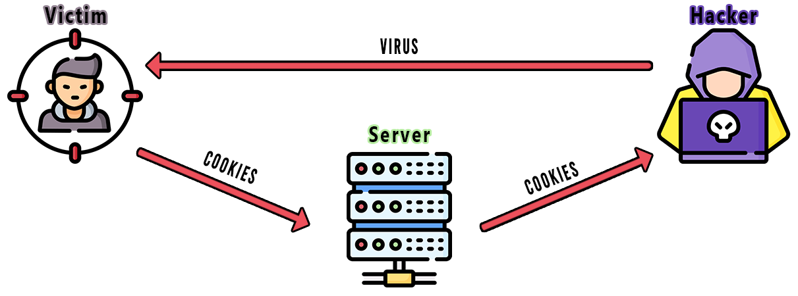

# How It Works

**A victim who has inadvertently fallen for the bait (triggered the virus).** 
After executing the virus, it exploits access to the directory where browsers store their settings and configuration files. The malware extracts sensitive data such as cookies and authentication tokens, logs the information, and ultimately allows the malicious actor to transmit these files to their own server, compromising the victim's privacy and security.

